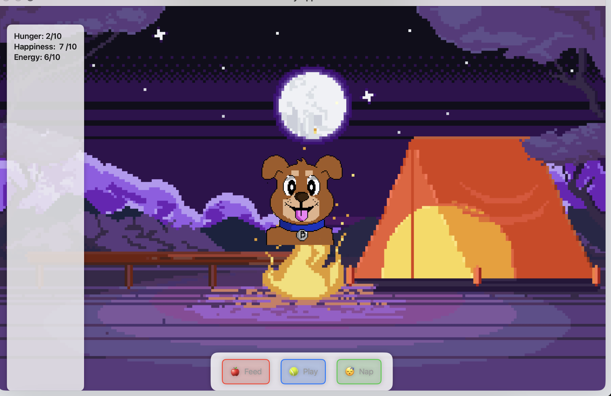

# 🐾 SwiftUI Virtual Pet

A simple virtual pet app built with SwiftUI. Keep your pet happy by feeding, playing, and letting it nap!

## 📱 Features

- 🍎 **Feed** your pet to reduce hunger  
- 🎾 **Play** to boost happiness  
- 😴 **Nap** to restore energy  
- ⏰ Stats decrease automatically over time  

## 🖼 Example

  
*Placeholder for an in-app screenshot*

## 🛠 How It Works

- Stats update using a `Timer` every 3 seconds  
- Press buttons to keep the pet alive and happy  
- Pet stats range from 0 to 10  

## 🧱 Built With

- SwiftUI  
- State Management (`@State`)  
- Timer (`.onReceive`)  

## 🚀 Future Ideas

- Game Over screen when stats hit 0  
- Animated pet reactions  
- Progress bars for visual feedback  

---

Happy coding! 🐶
